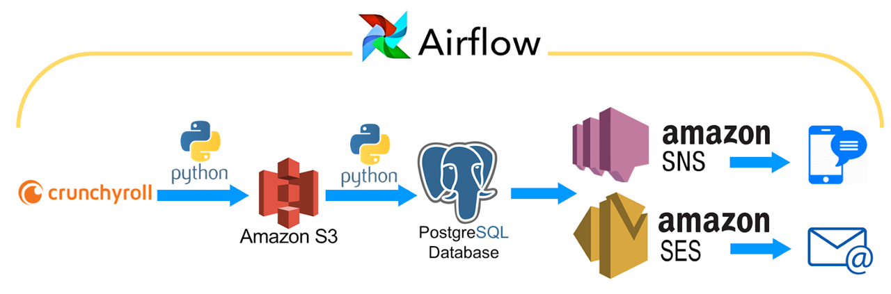

# AnimeToday
#### *Gotta Watch 'Em All!*
* [Introduction](README.md#Introduction)
* [Demo](README.md#Demo)
* [Approaches](README.md#Approaches)
* [Getting Start](README.md#Getting-Start)
* [Future Work](README.md#Future-Work)

## Introduction
Anime fans always want to keep up with their favorite anime. Let **AnimeToday** help you do it.

**AnimeToday** is an anime tracking application. Instead of checking the website multiple times per day, with **AnimeToday**, you will be notified once the anime you are following have new episodes air. Moreover, it will give you the url of that episode, so that you can start watch with only one click! 

Now it only support *crunchyroll.com*. It will expend to more websites in the future.

## Demo

## Approaches

1. **Pooling data**
Crawl *Crunchyroll*. Save all html code of websites needed into AWS S3 bucket as text file.
2. **Scraping data**
Use python library `BeautifulSoup` to extract information about the name of anime, episodes of anime, url of the cover picture, etc. Store them into PostgreSQL

3. **Querying and Notifying users**
Select episodes that release today, sending notifications to those users who are following the anime though email and sms
5. **Automation**
Add Apache Airflow on top of the pipline to automate the workflow, so that it can easily run daily or any frequency.
6. **Scaling up**
Built a distributed architecture. Able the pipeline to handle higher volume as well as be fault-tolerant

## Getting Start

### Basic Pipeline
#### Prerequisites
* Installations
  * postgresql 10
  * python 3.6
  * boto3
  * psycopg2
* Services
  * AWS EC2
  * AWS S3
  * AWS SES
  * AWS SNS 

### Automated with Airflow
* Installations
  * Airflow 1.10.1

### Scale up number of workers
* Installations
  * Airflow 1.10.1
  * Celery 4.1.1
  * RabbitMQ 3.7.0
## Future Work

* Use Spark to do batch processing
* Build a front end for user to register and choose animes
* Set AWS EC2 Auto Scaling Groups Policy to automatically launch more workers as needed
